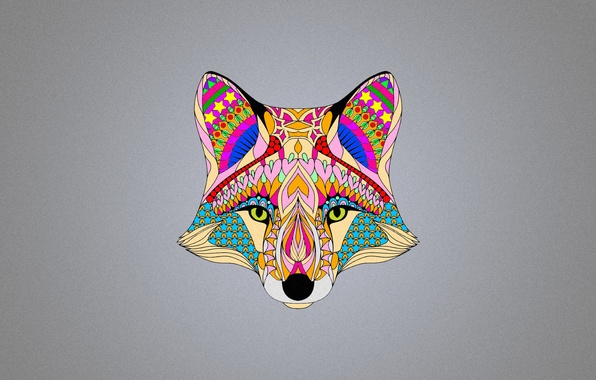

Преобразование BMP в монохромную картинку
---
- #### Адрес BMP можно `ввести в консоли` или передать в качестве `аргумента консоли`
- #### Данные для струтур `BITMAPFILEHEADER` и `BITMAPINFO` взяты [с википедии](https://ru.wikipedia.org/wiki/BMP)

