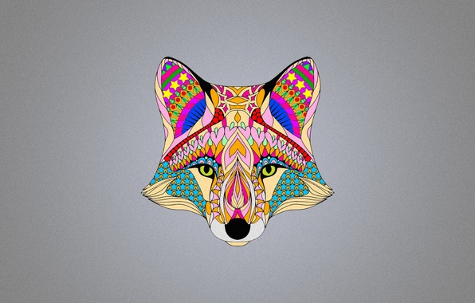

Преобразование BMP в монохромную картинку
---
- #### Адрес BMP можно `ввести в консоли` или передать в качестве `аргумента консоли` с помощью drag'n'drop
- #### Данные для струтур `BITMAPFILEHEADER` и `BITMAPINFO` взяты с <https://ru.wikipedia.org/wiki/BMP>
---

---

---
